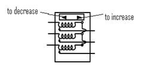
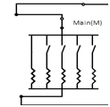
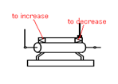
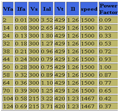
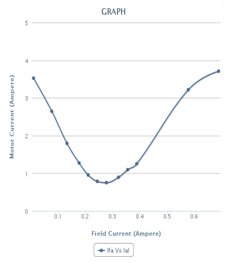

### V and Inverted V curves of Synchronous Motor
1. The machine under consideration salient pole synchronous motor. The short circuited aluminium damper bars are put in the rotor to make it self-starting. When 3 phase supply is applied to the stator of motor, motor will act like induction machine and it will attain speed slightly less than synchronous speed.
This is achieved by switching on the 3 phase supply with TPST (triple pole single throw) for synchronous motor.
2. With the help of 3 phase auto-transformer the voltage to be applied to the stator of synchronous motor is varied smoothly. When motor attends speed near to synchronous speed (generally at rated voltage), turn field supply on of motor with help of DPST (double pole single throw) switch and apply rated voltage in steps. Here onwards the speed of synchronous machine will be constant as synchronous speed.

3. Output of motor will drive DC generator which in turn will drive electrical load (resistive load bank).

4. Now depending on excitation for synchronous machine (which can be varied by altering rheostat arrangement in expt.) given to the synchronous motor, the power factor of motor will operate on the (over-excitation) leading, (critical) unity or (under-excited) lagging power factor.

5. To keep air gap flux constant in synchronous motor reactive power is needed. It is met by AC supply of synchronous motor depending on its field excitation. Plot the variations of stator current drawn by the synchronous motor with its field current.
6. Its graph follows shape of V, hence the name V curves. This characteristic of synchronous machine. Variation of power factor with field current of motor in exactly reverse fashion, which is called as inverted V curves. The point of least armature current drawn from stator of Synchronous motor will correspond to unity power factor and both graphs will have same field current reading.
7. Store this data by clicking "Start Storing Data"
8. Go on repeating this procedure till all load are connected and data is stored.
9. Now display the data by clicking "Show data". For Ex.

* Vfa=field voltage of alternator
* Ifa=field current of alternator
* Vt=terminal voltage
* Vs=supply voltage
* Ial=alternator current

10. These V curves can be performed on various loads and no load conditions on the synchronous motors.
11. While switching motor off, in stepwise manner reduce the stator supply to zero, and switch off TPST (triple pole single throw) switch. Then in steps cut down field supply for synchronous motor.

12. Now select one of the graph from available graphs and use "Generate graph" to plot the graph.